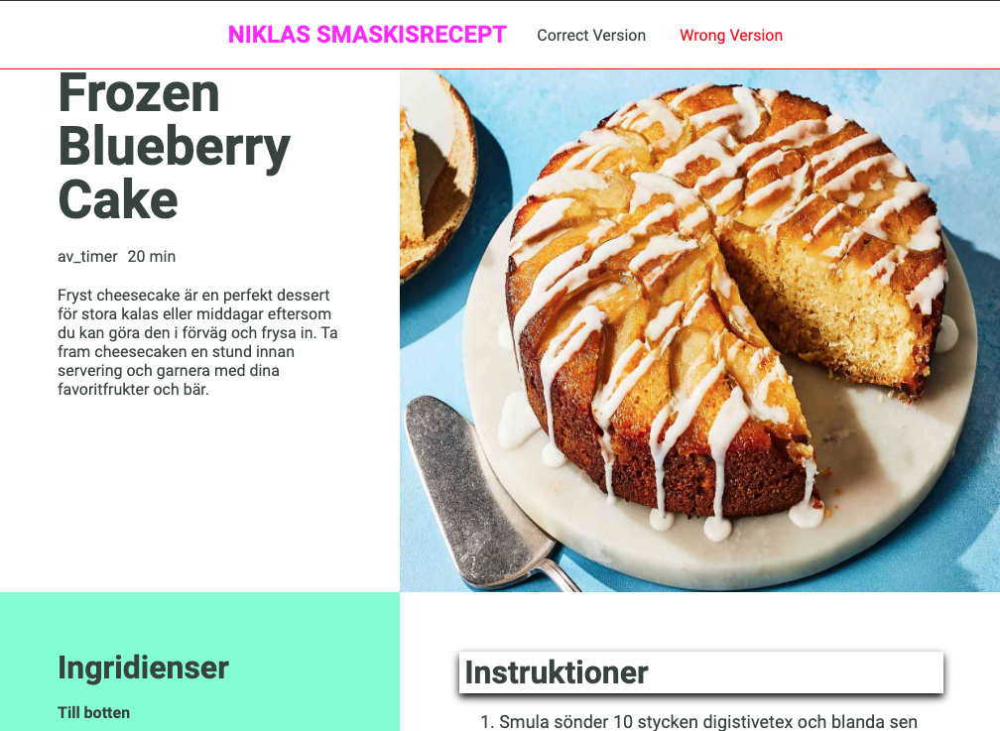
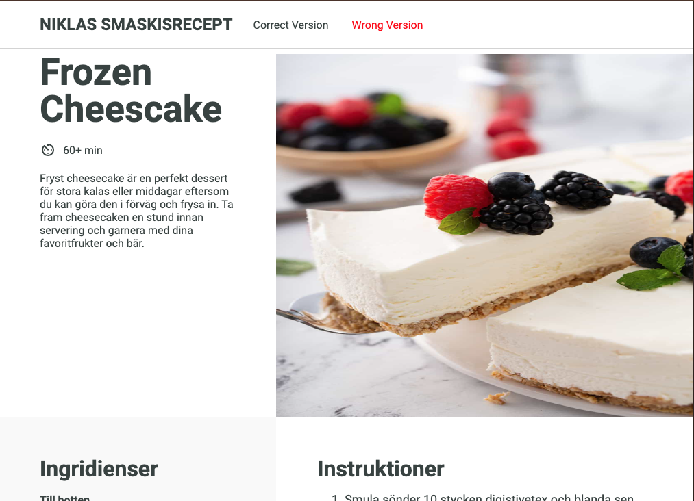

# Recipe DOM Fixer

This project involves a series of exercises focused on manipulating and retrieving data from the DOM using JavaScript.

<figure></figure>
TO
<figure></figure>

[Go To Exercises on DOM Manipulation Part 1](#exercises-on-dom-manipulation-part-1)

[Go To Exercises in DOM manipulation Part 2](#exercises-in-dom-manipulation-part-2)

## My Solution For Part 1

```js
//? 1.What is the name of the recipe?

// 1.1
const recipeNameQuery = document.querySelector('.logo-text').textContent;
console.log('🚀 ~ recipeNameQuery:', recipeNameQuery);
// Niklas smaskisrecept

// 1.2
const recipeNameGet = document.getElementsByClassName('logo-text')[0].innerHTML;
console.log('🚀 ~ recipeNameGet:', recipeNameGet);
// Niklas smaskisrecept
```

```js
//? 2.What HTML tag is used to display the Recipe name?

// 2.1
const recipeNameTagQuery = document.querySelector('header p');
console.log('🚀 ~ recipeNameTagQuery:', recipeNameTagQuery);
// <p class="logo-text">Niklas smaskisrecept</p>

// 2.2
const recipeNameTagGet = document.getElementsByTagName('p')[0];
console.log('🚀 ~ recipeNameTagGet:', recipeNameTagGet);
// <p class="logo-text">Niklas smaskisrecept</p>
```

```js
//? 3.What is the font size of the paragraph tag with the class "description".

const description = document.querySelector('.description');
const descriptionStyles = window.getComputedStyle(description);
const descriptionFontSize = descriptionStyles.fontSize;
console.log('🚀 ~ descriptionFontSize:', descriptionFontSize);
// 16px
```

```js
//? 4.What is the value of the alt atrribute on the image?

const image = document.querySelector('.image-container img');
const imageAltValue = image.getAttribute('alt');
console.log('🚀 ~ imageAltValue:', imageAltValue);
// Slice of Frozen Cheescake
```

```js
//? 5. What is the dimensions and the url of the image?
// Create an object that lookslike this, and log it to the console:
// {
//   url: string
//   height: number,
//   width: number,
// }

const image2 = document.querySelector('.image-container img');
const image2Styles = window.getComputedStyle(image2);

//url
const image2Url = image2.getAttribute('src');

//height
const image2HeightString = image2Styles.height;
const image2HeightNum = Number(image2HeightString.replace(/[^.\d]/g, ''));

//width
const image2WidthtString = image2Styles.width;
const image2WidthtNum = Number(image2WidthtString.replace(/[^.\d]/g, ''));

const imageData = {
  url: image2Url,
  height: image2HeightNum,
  witwidthh: image2WidthtNum,
};
console.log('🚀 ~ imageData:', imageData);
// {
//     "url": "assets/frozen-cheesecake-slice.jpg",
//     "height": 891.188,
//     "witwidthh": 516
// },
```

```js
//? 6. How many ingredients has the paste?

const numOfPasteIngredients = document.querySelectorAll(
  '.ingredients-list-paste li'
).length;
console.log('🚀 ~ numOfPasteIngredients:', numOfPasteIngredients);
// 5
```

```js
//? 7. Which is the forth element in the list containing the ingredients for the paste?

const fourthElementOfPasteIngredients = document.querySelectorAll(
  '.ingredients-list-paste li'
)[3].textContent;
console.log(
  '🚀 ~ fourthElementOfPasteIngredients:',
  fourthElementOfPasteIngredients
); // 3dl vispgrädde
```

```js
//? 8. Create an an array of objects from the instructions. Each element in the array should be an object that looks like this:
// {
//   order: number;
//   text: instruction;
// }

const instructionsList = document.querySelectorAll('.instructions-list li');
const instructionArr = [];
instructionsList.forEach((instruction, index) => {
  const tempObj = { order: index + 1, text: instruction.innerText };
  instructionArr.push(tempObj);
});
console.log('🚀 ~ instructionArr:', instructionArr);
// {
//     "order": 1,
//     "text": "Smula sönder 10 stycken digistivetex och blanda sen med smöret. Bred ut det i botten av en en rund form med lösbara kanter. Det ska bli som en tjockt täcke på botten av formen."
// },
// {
//   ...
// },
// ...
```

<hr>
<hr>
<hr>
<hr>
<hr>
<hr>
<hr>

## Exercises on DOM Manipulation Part 1

### Getting data from the DOM.

#### In this exercise you will try and get some data from the provided recipe website. Fire up the index.html on your live server.

Use the appropriate methods and properties available to you to get the correct data from the "correct" recipe. All answers should be saved in some variable and logged to the console. If you don't know the right method or property to use, see this link for all available ones: https://www.w3schools.com/jsref/dom_obj_all.asp

1. What is the name of the recipe?
2. What HTML tag is used to display the Recipe name?
3. What is the font size of the paragraph tag with the class _"description"_.
4. What is the value of the `alt` atrribute on the image?
5. What is the dimensions and the url of the image? Create an object that looks like this, and log it to the console:

```js
{
  url: string
  height: number,
  width: number,
}
```

6. How many ingredients has the paste?
7. Which is the forth element in the list containing the ingredients for the paste?
8. Create an an array of objects from the instructions. Each element in the array should be an object that looks like this:

```js
{
  order: number;
  text: instruction;
}
```

## Exercises in DOM manipulation Part 2

In this exercise you will be using the same pre-built webside. What's special about this website is that it comes in two versions. One which is the "correct" one and one that has many "errors" in it. Your task is to correct these errors with the aid of JavaScript. All of the right answers, styling, formatting and texts can be found in the correct version of the site. So there is your reference so to speak.

Each question in the following list of questions aims at a specific error on the website, and it goes from top to bottom and left to right on the website.

The solution to all these question can be reached by using the different DOM manipulation methods and properties that you might have or might not have learned during the course. Some googling might be required. This link might help you:
https://www.w3schools.com/jsref/dom_obj_all.asp

1. The logo text of the site has the wrong color. Change it to the correct one.
2. The alignment of the elements inside the header element are wrong. Change it to the correct one. `Hint`, check the flex properties for the correct alignment. Here is a link that might help:
   https://css-tricks.com/snippets/css/a-guide-to-flexbox/
3. The header has a border at the bottom, but it has the wrong color. Change it do the correct one.
4. The recipe name is wrong, change it to the correct one.
5. The clock icon beneath the recipe name has disappeared and been replaced by a text instead. This can be fixed by adding a class to that element.
6. The estimated time of the recipe is also incorrect. Change it to the correct time estimation.
7. The src path to the image is wrong, or atleast it's showing the wrong image. Change it to the correct one. The available images can be found in the assets folder.
8. The background color of the ingredients list container is wrong. Fix it.
9. The ingredients are divided in to two parts, one for the bottom and one for the paste. In the list of the ingredients to the bottom, there is a text instead of two list items. Remove the text and add those two list items.
10. The third ingredient in the list of ingredients to the paste is wrong. Change that specific ingredient to the correct one.
11. There is also a missing ingredient in the list of ingredients to the paste. Look and see what it is and add that one the the end of the list.
12. The text "Instructions" to the left, beneath the image, has some shadow styling applied to it. Remove that styling.
13. Two list elements of the list of instructions are incorrect. Find them and change them to the correct ones.
